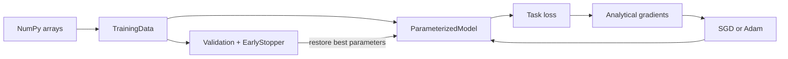

# abstract_ml

`abstract_ml` is an educational, NumPy-first machine-learning toolkit built from
scratch. It focuses on making the mechanics of model training visible: forward
passes, analytical gradients, parameter updates, validation, and adversarial
training are implemented directly instead of being delegated to a deep-learning
framework.

The repository is a useful playground for understanding how common models are
assembled from small abstractions. It includes multilayer perceptrons (MLPs),
regression and classification wrappers, GAN/WGAN trainers, MNIST file loading,
activation functions, optimizers, and a Fréchet-style distribution distance.

> This is an experimental/learning project rather than a production ML library.
> The notebooks are the primary demonstrations and contain the most complete
> end-to-end workflows.

## What is included

| Area | Implementation | Where to look |
| --- | --- | --- |
| Model abstraction | `ParameterizedModel` with forward and gradient-by-input/parameter contracts | `src/general_model/` |
| Optimization | SGD and Adam, including optimizer state copying/reset | `src/general_model/optimizer.py` |
| Training control | Random train/validation split, mini-batch sampling, EMA-based early stopping, best-parameter restore | `src/utils/data_handler.py`, `src/general_model/validation.py` |
| Neural networks | Fully connected MLP with per-layer activations and bias terms | `src/mlp_structure/multi_layer_perceptron.py` |
| Regression | Least-squares linear regression and gradient-trained neural regression | `src/regression/` |
| Classification | Softmax probabilities, cross-entropy loss, integer-label training, accuracy | `src/classification/` |
| Generative models | GAN and WGAN training loops with Gaussian latent noise | `src/gan_model/` |
| Constraints and metrics | Activation Lipschitz metadata, MLP normalization, raw/feature-space FID-style distance | `src/utils/function_collections.py`, `src/utils/helpers.py` |
| Dataset handling | MNIST IDX image/label loader | `src/mnist/mnist_handle.py` |

## Architecture

The main training path is deliberately modular:



Task-specific classes build on the same model contract:

```text
MultiLayerPerceptron
├── NeuralRegressor       -> MSE + Adam
├── NeuralClassifier      -> softmax cross-entropy + Adam
├── NeuralGAN             -> generator + discriminator + Adam
└── NeuralWGAN            -> generator + 1-Lipschitz critic + Adam
```

## Repository layout

```text
abstract_ml/
├── script/                  # Executable Jupyter demonstrations
│   ├── experiment.ipynb     # Synthetic regression and classification
│   ├── experiment_gan.ipynb # GAN on a noisy 2-D function/manifold
│   ├── gan_mnist.ipynb      # MNIST GAN experiment (digit 0 selection cell)
│   ├── gan_mnist_1.ipynb    # MNIST GAN variant (digit 1 selection cell)
│   └── mnist_classification.ipynb
├── src/
│   ├── classification/
│   ├── gan_model/
│   ├── general_model/
│   ├── mlp_structure/
│   ├── mnist/
│   ├── regression/
│   └── utils/
├── .gitignore
└── README.md
```

There is currently no packaging configuration or command-line entry point. From
the repository root, import modules through the `src` package, for example:

```python
from src.classification.neural_classification import NeuralClassifier
from src.regression.neural_regression import NeuralRegressor
```

## Installation

Python 3.12 or newer is recommended because the code uses modern typing
features such as `typing.override`.

```bash
git clone https://github.com/hieutran-tud/abstract_ml.git
cd abstract_ml

python -m venv .venv
```

Activate the environment:

```bash
# macOS/Linux
source .venv/bin/activate

# Windows PowerShell
.venv\Scripts\Activate.ps1
```

Install the runtime and notebook dependencies:

```bash
python -m pip install --upgrade pip
python -m pip install numpy matplotlib jupyterlab ipykernel
```

The core source code only depends directly on NumPy. Matplotlib and JupyterLab
are used by the checked-in demonstrations.

Verify the checkout with:

```bash
python -m compileall -q src
python -c "from src.gan_model.neural_gan import NeuralGAN, NeuralWGAN; print('abstract_ml import ok')"
```

## Quick start: neural regression

The wrappers accept two-dimensional NumPy arrays shaped as
`(samples, features)` and `(samples, outputs)`.

```python
import numpy as np

from src.regression.neural_regression import NeuralRegressor
from src.utils import function_collections as fc

rng = np.random.default_rng(7)
x = np.linspace(-2, 2, 400).reshape(-1, 1)
y = (x**3 + 0.1 * rng.normal(size=(400, 1))).astype(float)

model = NeuralRegressor(
    input_dim=1,
    output_dim=1,
    hidden_layers=[32, 32],
    activation=fc.leaky_relu,
    rand_gen=np.random.default_rng(7),
)

training_loss, validation_loss = model.train_model(
    x,
    y,
    epochs=100,
    batch_size=32,
    learning_rate=1e-3,
    validation_ratio=0.2,
)

predictions = model.predict(x[:5])
print(predictions)
print("R²:", model.r2_score(x, y))
```

`train_model` returns the per-epoch training and validation histories. The
default early stopper smooths validation loss and restores the best parameters
when training finishes.

## Quick start: classification

`NeuralClassifier` converts integer labels into one-hot distributions internally
and exposes both class probabilities and hard labels.

```python
import numpy as np

from src.classification.neural_classification import NeuralClassifier
from src.utils import function_collections as fc

rng = np.random.default_rng(11)
x = rng.normal(size=(600, 2))
y = (x[:, 0] + x[:, 1] > 0).astype(int)

model = NeuralClassifier(
    input_dim=2,
    num_classes=2,
    hidden_layers=[16, 16],
    activation=fc.leaky_relu,
    rand_gen=np.random.default_rng(11),
)

training_loss, validation_loss = model.train_model_with_labels(
    x,
    y,
    epochs=100,
    batch_size=32,
    learning_rate=1e-3,
    validation_ratio=0.2,
)

probabilities = model.predict_distribution(x[:5])
labels = model.predict_label(x[:5])
print("accuracy:", model.accuracy(x, y))
```

For a non-neural baseline, `LinearRegressionModel.fit(x, y)` uses NumPy's
least-squares solver and provides the same `predict` and `r2_score` style
evaluation methods.

## Quick start: GANs

The GAN trainers operate on a two-dimensional array of real samples. A sample
is a row and its columns are the data dimensions.

```python
import numpy as np

from src.gan_model.neural_gan import NeuralGAN, NeuralWGAN
from src.utils import function_collections as fc

rng = np.random.default_rng(21)
real_data = rng.normal(size=(2_000, 2))

gan = NeuralGAN(
    data_dim=2,
    latent_dim=8,
    hidden_layer=[32, 32],
    activation=fc.leaky_tanh,
    rand_gen=rng,
)
training_outcomes, validation_loss = gan.train_model(
    real_data,
    epochs=100,
    batch_size=64,
    learning_rate=5e-4,
    validation_ratio=0.1,
    rand_gen=rng,
)
synthetic_samples = gan.generate(32)
```

`training_outcomes` contains `(discriminator_loss, generator_loss)` pairs. For a
Wasserstein objective, replace `NeuralGAN` with `NeuralWGAN`; its critic uses
real-valued scores and the trainer re-applies the MLP Lipschitz normalization
after critic updates. Both trainers expose `fid_score`, which compares the
means and covariance matrices of raw data or of features returned by an
optional `feature_extractor`. It is a lightweight Fréchet-style metric, not a
full Inception-model implementation.

## Notebook tour

Run the notebooks from `script/`. Their setup cells calculate paths relative to
that working directory.

```bash
cd script
jupyter lab
```

| Notebook | Demonstration |
| --- | --- |
| `experiment.ipynb` | Fits a neural regressor to a noisy one-dimensional nonlinear function, then trains a binary classifier on a synthetic interval-based decision rule. It plots predictions, losses, probabilities, and logits. |
| `experiment_gan.ipynb` | Trains `NeuralGAN` on noisy samples from a two-dimensional nonlinear curve/manifold and compares generated and original samples. |
| `gan_mnist.ipynb` | Loads MNIST IDX files, normalizes images, and demonstrates a GAN workflow with a digit-selection preparation cell. |
| `gan_mnist_1.ipynb` | A second MNIST GAN variant with a different digit-selection value. |
| `mnist_classification.ipynb` | Loads and visualizes MNIST, trains a large MLP classifier, reports test accuracy/loss, and displays misclassified images. |

The committed notebook outputs include demonstration results such as 0.969
accuracy on the synthetic classifier and 0.9724 accuracy on the stored MNIST
classification run. These are illustrative notebook outputs, not maintained
benchmarks; rerun the notebooks before comparing experiments.

## MNIST data setup

MNIST binaries are intentionally excluded by `.gitignore`. The loader expects
the four uncompressed IDX files at these exact paths:

```text
src/mnist/data/train-images-idx3-ubyte/train-images-idx3-ubyte
src/mnist/data/train-labels-idx1-ubyte/train-labels-idx1-ubyte
src/mnist/data/t10k-images-idx3-ubyte/t10k-images-idx3-ubyte
src/mnist/data/t10k-labels-idx1-ubyte/t10k-labels-idx1-ubyte
```

After placing the files, start Jupyter from `script/` and open either MNIST
notebook. The notebooks currently prepare per-digit subsets but their training
cell passes the combined normalized array to the GAN; edit that cell if you
want to train on only the selected digit.

## Activations and custom models

Built-in differentiable activation wrappers live in
`src/utils/function_collections.py`:

```python
from src.utils import function_collections as fc

fc.identity
fc.logistic
fc.tanh
fc.relu
fc.swish
fc.softplus
fc.leaky_relu
fc.leaky_tanh
fc.leaky_logistic
fc.soft_leaky
```

`RealDifferentialFunc` stores a function, its derivative, and a Lipschitz
constant. When creating a custom activation, provide the derivative and
Lipschitz constant explicitly. The numerical scalar minimizer used as a
fallback is currently a placeholder and raises `NotImplementedError`.

To add a new trainable model, implement the `ParameterizedModel` contract:

1. `forward(x)` for the model output.
2. `loss_gradient_by_param(x, dloss_doutput)` for parameter gradients.
3. `loss_gradient_by_input(x, dloss_doutput)` for chained gradients.
4. `input_dim()` and `output_dim()` for shape metadata.

That model can then be composed with the existing regression, classification,
or adversarial training abstractions.

## Current limitations and next improvements

The repository is intentionally compact, but a public project should make these
boundaries clear:

- There is no `pyproject.toml`, locked dependency file, automated test suite, or
  CI workflow yet.
- Training is NumPy-only and CPU-oriented; large MNIST GAN configurations can
  be slow and memory-intensive.
- The notebooks contain hard-coded relative paths and long-running training
  cells. Seeded random generators help reproducibility, but results can still
  vary by environment.
- `minimize_scalar` is not implemented, so custom activations need explicit
  derivatives and Lipschitz constants.
- The FID helper operates in raw or user-supplied feature space and does not
  provide a pretrained feature extractor.
- No license file is included at present. Add a license before treating the
  project as a reusable dependency or accepting outside contributions.

Good next steps would be a small unit-test suite for gradients and losses,
packaging the library under a dedicated import name, a reproducible dependency
file, notebook path configuration, and a CI workflow that runs the lightweight
checks without executing the full training experiments.

## Contributing

Small, focused improvements are welcome. Before opening a pull request, run the
compile/import checks above and document any changes to model shapes, loss
definitions, or notebook assumptions. Keep generated datasets, checkpoints,
virtual environments, and notebook scratch files out of commits.
