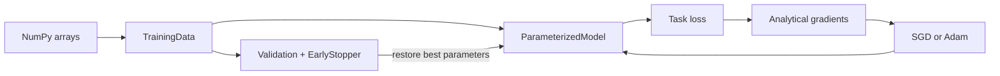

# abstract_ml

[](https://github.com/hieutran-tud/abstract_ml/actions/workflows/ci.yml)
[](https://www.python.org/)
[](LICENSE)

A NumPy-first educational machine-learning toolkit built from scratch.

> Status: experimental / alpha. The project is designed for learning and experimentation, not production deployment.

## Why this project exists

`abstract_ml` makes the mechanics of model training visible. Forward passes, analytical gradients, parameter updates, validation, and adversarial training are implemented directly instead of being hidden behind a deep-learning framework.

The codebase is intentionally small enough to read end-to-end while still covering reusable abstractions for multilayer perceptrons, regression, classification, GANs, WGANs, optimizers, early stopping, and MNIST loading.

## Features

- NumPy-based parameterized-model contract with explicit gradients.
- MLPs with configurable hidden layers and differentiable activations.
- SGD and Adam optimizers.
- Train/validation splitting, mini-batch sampling, early stopping, and best-parameter restore.
- Linear and neural regression plus softmax classification.
- GAN and WGAN training loops with spectral/Lipschitz normalization support.
- A lightweight Fréchet-style distribution distance for raw or extracted features.
- Executable notebooks for synthetic data and MNIST experiments.

## Project layout

```text
abstract_ml/
├── src/abstract_ml/       # Installable library package
├── tests/                 # Fast unit and numerical checks
├── notebooks/             # Reproducible demonstrations
├── pyproject.toml         # Packaging and development tools
├── Dockerfile             # Optional Jupyter environment
└── README.md
```

## Installation

Python 3.12 or newer is required.

```bash
python -m venv .venv

# macOS/Linux
source .venv/bin/activate

# Windows PowerShell
.venv\\Scripts\\Activate.ps1

python -m pip install --upgrade pip
python -m pip install -e ".[dev,notebooks]"
```

Verify the installation:

```bash
abstract-ml --version
python -m pytest
```

## Quick start

```python
import numpy as np

from abstract_ml import NeuralRegressor
from abstract_ml.utils import function_collections as fc

rng = np.random.default_rng(7)
x = np.linspace(-2, 2, 400).reshape(-1, 1)
y = (x**3 + 0.1 * rng.normal(size=(400, 1))).astype(float)

model = NeuralRegressor(
    input_dim=1,
    output_dim=1,
    hidden_layers=[32, 32],
    activation=fc.leaky_relu,
    rand_gen=np.random.default_rng(7),
)

training_loss, validation_loss = model.train_model(
    x,
    y,
    epochs=100,
    batch_size=32,
    learning_rate=1e-3,
    validation_ratio=0.2,
)

predictions = model.predict(x[:5])
print(predictions)
print("R²:", model.r2_score(x, y))
```

The public package exports the most common entry points directly:

```python
from abstract_ml import (
    Adam,
    LinearRegressionModel,
    MultiLayerPerceptron,
    NeuralClassifier,
    NeuralGAN,
    NeuralRegressor,
    NeuralWGAN,
    SGD,
)
```

## Notebooks

```bash
cd notebooks
jupyter lab
```

See [`notebooks/README.md`](notebooks/README.md) for the notebook map and MNIST setup.

The MNIST notebooks expect the four uncompressed IDX files under:

```text
data/mnist/
├── train-images-idx3-ubyte
├── train-labels-idx1-ubyte
├── t10k-images-idx3-ubyte
└── t10k-labels-idx1-ubyte
```

The dataset is intentionally not committed. The loader validates file headers, image/label counts, and payload sizes before returning NumPy arrays.

## Development

Run the checks locally:

```bash
python -m compileall -q src
ruff check src tests
python -m pytest --cov=abstract_ml --cov-report=term-missing
```

Continuous integration runs these checks on Python 3.12 and 3.13.

## Design notes

The main training path is deliberately modular:


```mermaid
flowchart LR
    X[NumPy arrays] --> D[TrainingData]
    D --> M[ParameterizedModel]
    M --> L[Task loss]
    L --> G[Analytical gradients]
    G --> O[SGD or Adam]
    O --> M
    D --> V[Validation + EarlyStopper]
    V -->|restore best parameters| M
```

For custom models, implement the `ParameterizedModel` contract. For custom activations, provide an explicit derivative and Lipschitz constant; automatic scalar minimization remains intentionally unimplemented.

## Current limitations

- This is a CPU-oriented NumPy implementation and is not optimized for large datasets.
- The notebooks contain long-running training cells; the synthetic notebook is the recommended smoke test.
- MNIST data must be downloaded separately.
- The Fréchet-style helper is not a full Inception-based FID benchmark unless supplied with an appropriate feature extractor.
- The API is still alpha and may change while the learning project evolves.

## Roadmap

- Add broader gradient and loss test coverage.
- Add configurable experiment files and a small command-line demo.
- Improve notebook execution time and data-download setup.
- Publish tagged releases when the API stabilizes.

## License

Released under the [MIT License](LICENSE).
